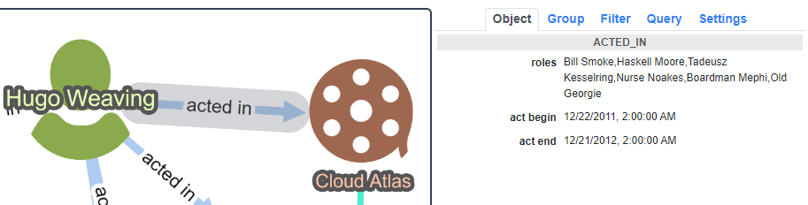
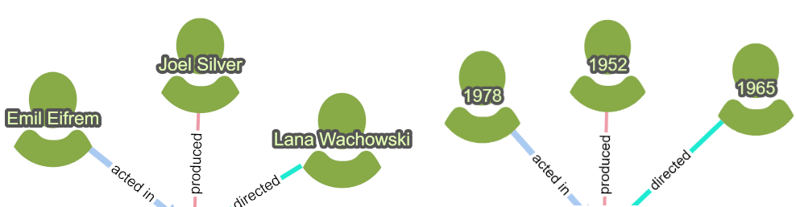
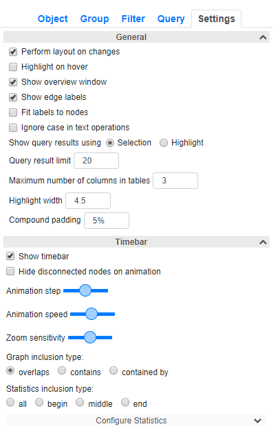
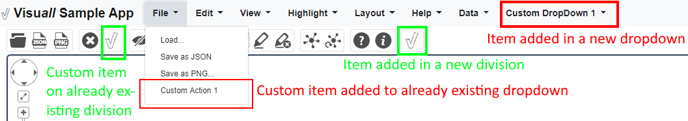

# Visu*all* Developer Guide

This guide details how a custom application can be built using Visu*all*. We assume the reader has already gone over [User Guide](UG.md), and in each of the following sections, we describe how to customize various parts of a Visu*all* based visual analysis tool.

Many of the things from the name and logo of your application to the type and style of nodes and edges to default values of various settings are defined in a so-called [description file](../src/assets/app_description.json). The description file contains many sections as detailed throughout this guide. 

Once this file is prepared, the [style generator file](../src/style-generator.js) modifies [index.html file](../src/index.html), [styles.css file](../src/styles.css), [properties.json file](../src/assets/generated/properties.json) and [stylesheet.json file](../src/assets/generated/stylesheet.json), resulting in the desired customization, using the command:

`node style-generator.js /assest/app_description.json`

Here is the overall look of the sample application on movies and people taking part in these movies:

<p align="center">
    
</p>


## Application Information

The first section of the description file named "appInfo" contains miscellaneous information about the visual application being developed as follows:

- **name**: Name of the application as it appears to the left of the menubar,
- **html_header**: Name of the application as it appears in the html page where Visu*all* is embedded,
- **icon**: Logo of the application as it appears to the left of the menubar,
- **version**: Version of the application as it appears in the About box,
- **company_name**: Name of the company / institution as it appears in the About box,
- **company_contact**: Contact info / email as it appears in the About box.

Below is how this section appears for the sample application:
```
  "appInfo": {
    "name": "Visu<i>all</i> Sample App",
    "html_header": "Visuall Sample App",
    "icon": "assets/img/logo.png",
    "version": "1.0.0 beta",
    "company_name": "i-Vis at Bilkent",
    "company_contact": "ivis@cs.bilkent.edu.tr"
  }
```
## Data Model

One of the essential definitions in this file is the structure of the data: the type and properties of *objects* and *relations* among these objects.

### Objects

The section named "objects" contains the stucture of different kinds of objects in your graphs. In other words, each *object* corresponds to a *node* type in your graph. For instance, in the sample movie application, there are two classes of nodes: `Person` and `Movie`. 

Each node has a set of associated *properties* and *style*. Each property has a name and data type. For example, `Person` class has the following properties: `name`, `born`, `start_t`, and `end_t`.  

Each *property* is one of the following data types: `string`, `int`, `float`, `datetime`, `list` and `enum`. Here, `string`, `float`, `int` are standard data types as described by most programming languages. `datetime`, on the other hand, is an integer which represents the date (and time in that date) in [Unix time stamp in milliseconds](https://currentmillis.com/). 

`list` is used to represent a *set of values* for a property. For instance, in our sample application, the `roles` property of `ACTED_IN` assumes a list of values corresponding to the list of roles assumed by the source `Person` in the target `Movie`. When the type of a property is `List`, binary operator used to specify values for it will be `in`. In the example below, we see that Hugo Weaving acted in a number of roles in Cloud Atlas.

<p align="center">
    
</p>

Finally, `enum` is a special type to define a group of pre-defined values for this property. Each `enum` type should be defined as a tuple `enum,<type>`, where the second element of the tuple corresponds to the type of the values in that enumeration. For instance, `enum,string` means this property's values are *string*. The corresponding set of values to be actually used must be defined in the section named `enumMapping` inside the description file. These values are shown to the user with a *dropdown box*.

For example, in the sample application, the genre of a movie is defined as an enumaration (i.e. `enum,string`) where the internal values as kept in the database and those values as shown in the application happen to be the same strings:
```
  "enumMapping": {
    "Movie": {
      "genre": {
        "Comedy": "Comedy",
        "Adventure": "Adventure",
        "Thriller": "Thriller",
        "Crime": "Crime",
        "Action": "Action",
        "Drama": "Drama"
      }
```
Hence, this property is shown as a dropdown box in the application user interface:

<p align="center">
    
</p>

### Relations

This section contains the strcuture of different kinds of relations among the objects in your graph. Each *relation* corresponds to an *edge* type in your graph with specifc types of `source` and `target` nodes. `isBidirectional` is used to specify if the edge is bi-directional (undirected) or uni-directional (directed). For instance, in the sample movie application, we define an edge type named `ACTED_IN` from `Person` objects to `Movie` objects as `source` and `target`, respectively, with `isBirectional` set to `false`.

### Styling graph objects

Look & feel of nodes (e.g. fill color and label) and edges (e.g. line color and width) in your graph can also be specified in the description file.

For instance, if you'd like a specific type of an edge to always have the color red, you specify the following (under the path `relations > ACTED_IN > style` in the description file) for that edge type:

`"line-color": "#ff0000"`

The value of a particular style element could also be mapped from a property of that graph object. For instance, in the sample application, for the label of the node type `Person`, we use the name of that person (under the path `objects > Person > style`) using:

`"label": "data(name)",`

Changing this line to

`"label": "data(born)"`

will result in born dates of persons to be displayed on associated nodes instead:

<p align="center">
    
</p>

Here, `data` is [a mapper](https://js.cytoscape.org/#style/mappers) provided by Cytoscape.js. Each Cytoscape.js element has a `data` function which returns the associated data of that element.

You may change many other styles such as `"text-valign"` for vertical alignment of labels, `"font-size"` for font size of labels, and `"shape"` for shape of a node. More details about styles in Cytoscape.js can be found [here](https://js.cytoscape.org/#style). Notice that Cytoscape.js style follows CSS conventions as closely as possible.

Styles of edges may be changed similarly.

Another advanced way to specify the style of a graph object is through a linear mapping based on the value of a property of the corresponding object. For instance, in the sample application, we size `Movie` nodes with respect to their ratings using (the higher the rating, the larger the movie's node):
```
"width": "mapData(rating, 0, 10, 20px, 60px)",
"height": "mapData(rating, 0, 10, 20px, 60px)"
```
Here, the rating is a value in range [0,10], which is linearly mapped to [20px,60px].

### Enumeration mapping

"enumMapping" section of the file is used to map enum values to actual values to be shown. For example, the status of a computer device in a computer network might be internally represented with integers 1 and 2, corresponding to "up" and "down". Here, the type of the property `status` should be defined as `enum,int`, and the corresponding values are provided in an enumeration mapping in this section as:
```
  "enumMapping": {
    "Device": {
      "status": {
        1: "up",
        2: "down"
      }
    ...
```

### Timebar

"timebarDataMapping" section of the model description file is used to map lifetime of nodes and edges. Lifetime information is used in [timebar service](../src/app/timebar.service.ts) to filter graph objects by time and show useful, user-defined statistics during the specified period. Ideally, each *object* and each *relation* would have two datetime properties corresponding to their *begin* and *end* datettimes. These two fields should be provided under *begin_datetime* and *end_datetime*, respectively. In case begin or end datetime of a graph object is not mapped to a property of that object, Visu*all* assumes the default begin (as early as minus infinity) and end datetimes (as late as plus infinity) for the timebar.

Minimum and maximum values for begin and datetimes are specified in the section on application default settings.

## Styling

"generalStyles" section of the file establishes styling of the canvas such as how selected objects are shown and how grouped (i.e. compound) nodes are to be shown as described [here](https://js.cytoscape.org/#style). While changing existing values should not break the styling of your Visu*all* component, adding or deleting new styling might result in undesired style problems; thus, use this with caution.

## Preferences

"appPreferences" section stores the preferences for general styling of the tool as well as defaults for settings. For instance, while some applications would prefer to show the Overview Window by default, others might not. These values can be found inside [the settings component](../src/app/operation-tabs/settings-tab/settings-tab.component.ts). These settings are injected to Visu*all* dynamically. Thus, when you make a change in a setting from the description file, you should observe the associated change in the graphical user interface upon reload of the web page.

<p align="center">
    
</p>

One particular setting specified in this section but not exposed to the user under the Settings tab are timebar related:
- **timebar_min**: Minimum begin date of graph objects in [Unix time stamp in milliseconds](https://currentmillis.com/),
- **timebar_max**: Maximum begin date of graph objects in [Unix time stamp in milliseconds](https://currentmillis.com/).

The developer also defines their style preferences in this section. For instance, Visu*all* makes use of the following text styles exclusively:
```
  "style": {
    ".va-title": {
      "font-size": "20px"
    },
    ".va-heading1": {
      "font-size": "14px",
      "font-weight": "bold"
    },
    ...
```

For example, `va-title` defines the style of the font for the tool tile while `panel-heading` defines the style of panel headings. By changing the style here, for instance defining the font family as "Arial" for all text types, you could consistenly use a different font in your application.

## Menus

[Navigation bar](../src/app/navbar/navbar.component.html) and [tool bar](../src/app/navbar/navbar.component.html) are also customizable components of Visu*all*. Visu*all* components are implemented in files whose names end with `.customization.service.ts`. Customization services are packaged separately to prevent future merge conflicts on updates to Visu*all*. 

To add new items on the navigation bar menu, modify [navbar-customization.service.ts file](../src/app/navbar/navbar-customization.service.ts) (i.e. the `_menu` array in this file).
```
this._menu = [ 
  { dropdown: 'File', actions: [{ txt: 'Custom Action 1', id: '', fn: 'fn1', isStd: false }] },
  { dropdown: 'Custom DropDown 1', actions: [{ txt: 'Custom Action 2', id: '', fn: 'fn2', isStd: false }]}
];
```

Here, if the menu named `dropdown` already exists, the new menu item will be prepended to that menu. Otherwise, a new menu will be created with the provided menu item. Note here that the functions of the menu items should be *without* parameters. Also note that `isStd` property of custom items must be `false` to distinguish them from standard menu items.

Even though the existing menu items are pretty standard in such a visual analysis tool, you might prefer to remove them by modifying the file [navbar.component.ts file](../src/app/navbar/navbar.component.ts). However, this might cause some merge conflicts as Visu*all* is updated in the future.

<p align="center">
    
</p>

New tools may be added to the toolbar similarly: 
```
this._menu = [{
   div: 12, items: [{ title: 'Custom Action 1', isRegular: true, fn: 'fn1', isStd: false, imgSrc: 'assets/img/logo.png' }]
 },
 {
   div: 1, items: [{ title: 'Custom Action 2', isRegular: true, fn: 'fn2', isStd: false, imgSrc: 'assets/img/logo.png' }]
 }];
 ```

## Context Menus

Visu*all* provides node, edge, and root context menus, provided by [a Cytoscape.js extension](https://github.com/iVis-at-Bilkent/cytoscape.js-context-menus). These menus can be customized in a similar way to the navbar menu and the toolbar. The [context-menu.service.ts file](../src/app/context-menu/context-menu.service.ts) contains essential, standard menu items, whereas the [context-menu-customization.service.ts file](../src/app/context-menu/context-menu-customization.service.ts) contains the custom ones. You may modify the [context-menu-customization.service.ts file](../src/app/context-menu/context-menu-customization.service.ts) file to custom tailor context menu items.

## Right Panel

The panel on the right consists of a number of tabs as detailed below.

### Object tab

As explained in the [User Guide](UG.md), this tab is used to inspect a selected object's properties. In case of multiple selection, common properties are shown here. The content of this tab is automatically generated and is *not* meant to be customizable.

### Group tab

Visu*all* uses [a Cytoscape.js extension](https://github.com/iVis-at-Bilkent/cytoscape.js-expand-collapse) to group nodes into compound nodes to better manage complexity. The sample application provides one generic way to group nodes using [the Markov clustering algorithm](https://js.cytoscape.org/#collection/clustering) provided by Cytoscape.js core and one application specific way (i.e. by director).

### Filter tab

As explained in the [User Guide](UG.md), this tab is used to filter the graph based on node/edge type or by putting together rules using graph object properties. The content of this tab is automatically generated and is *not* meant to be customizable.

### Query tab

The queries defined in [the Query tab](../src/app/operation-tabs/query-tab/query-tab.component.ts) are all application specific ones. Each query here should be an *angular component* with the path `../src/app/operation-tabs/query-tab/`. In Visu*all* sample app, there are two movie related queries:
- [Get actors with movie counts](../src/app/operation-tabs/query-tab/query0/query0.component.ts) and
- [Get movies by genre](../src/app/operation-tabs/query-tab/query1/query1.component.ts).

Name of such components do not have to follow a certain format but in order for them to be visible, they should be inside [the query tab component html file](../src/app/operation-tabs/query-tab/query-tab.component.ts) formatted like
```
<app-query0 *ngIf="selectedIdx==0"></app-query0> <app-query1 *ngIf="selectedIdx==1"></app-query1>
```
Also, their display names should be added to [the Query tab component file](../src/app/operation-tabs/query-tab/query-tab.component.ts). For the sample app, we have the following two queries in this file:

`this.queryTypes = ['Get actors by movie counts', 'Get movies by genre'];`

### Settings tab

As explained in the [User Guide](UG.md), this tab is used to change all types of settings in your application. The content of this tab is automatically generated and is *not* meant to be customizable.

## Using A Different Database 

To use a different database in the back end, you should modify [the db-adapter.service.ts file](../src/app/db-service/db-adapter.service.ts). Idealy, only changing the constructor of the service should be sufficient. Just by injecting [your own angular service](https://angular.io/tutorial/toh-pt4) which implements [the interface DbService](../src/app/db-service/data-types.ts), you can switch to another database. Of course for your application-specific queries, you will want to change/delete existing ones or implement new ones.

For each database, database dependent query code should be inside only one file. This file is the angular service that you should generate as your database driver. For example, Visu*all* uses Neo4j database. All the queries which are specific to Neo4j are inside the file named [neo4j-db.service.ts](../src/app/db-service/neo4j-db.service.ts). Neo4j uses a query language called [Cypher](https://neo4j.com/developer/cypher-query-language/) for querying the database.

Some database queries are generated by parsing filtering rules while others are hardcoded. For parsing rules, you can check the implementation of the function called `rule2cql` inside the file [neo4j-db.service.ts](../src/app/db-service/neo4j-db.service.ts). Since the queries are application-specific, they will look different or might not even exist.
