# Visu*all* User Guide

This guide shows how Visu*all* sample application can be used to analyze movie dataset available in this application. This sample app assumes a Neo4j databasase installed on a server side with free and openly available movie dataset. The client side on the other hand is a web page with main components of a menubar and a toolbar on top, a drawing canvas to show relations as a graph / map and a collection of panels on the right.

  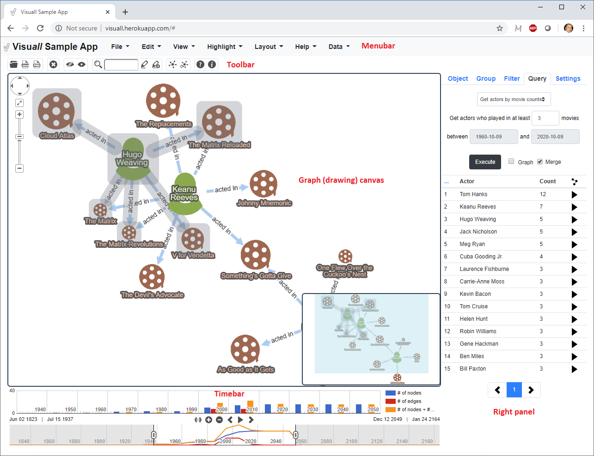

Visu*all* uses [Cytoscape.js](https://js.cytoscape.org/) and many of [its extensions](https://js.cytoscape.org/#extensions) to provide a drawing canvas, where relations among various movies and people involved can be visualized and further inspected. Hence, Visu*all* maintains your graphs in a Cytoscape.js model on the client side. And many of the capabilities of Visu*all* are inherited from Cytoscape.js, including pan, zoom, drag, navigator window, context menus, automatic layout, etc.

## Menubar

Menubar contains many different, file, editing, view, highlight and layout operations. The File menu allows one to save the current map to disk and load it back when needed. It also allows you to save the current map as a static PNG image. In addition, the Edit menu allows the user to delete selected map objects from the map. The view menu contains operations to manage complexity of the map by *temporarily* hiding selected map objects and showing them back when needed. Notice that this is different from deletion, which deletes the map objects from the Cytoscape.js model, and hence the client. Below you will find: an original map with certain objects selected (left), after selected objects are hidden using `View > Hide Selected` (middle), and when all map content in the client is shown with `View > Show All`.

  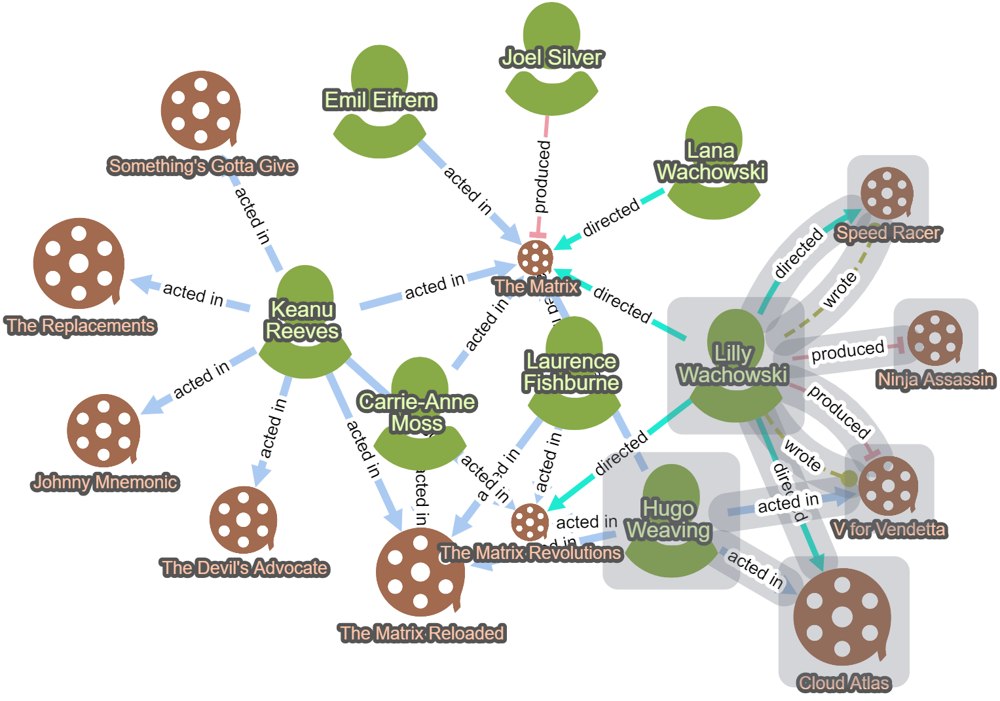&emsp;&emsp;&emsp;
  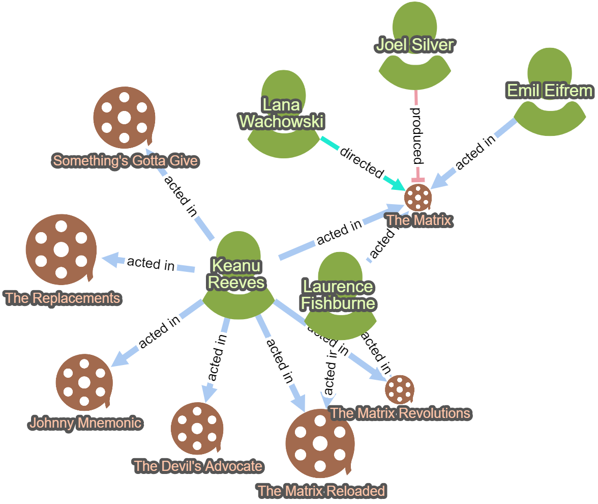&emsp;&emsp;&emsp;
  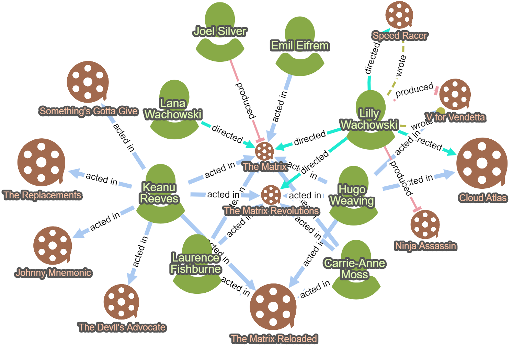

The highlight menu aims to draw attention to certain map objects (e.g. a group of nodes and/or edges or paths in the underlying network). 

The user may use this menu to highlight map objects that contain a specified substring in their labels or other properties (numbers are converted to strings before such a search is applied). All highlights made so far could be removed from the map using `Remove Highlights` in this menu. Below is the result of searching "Neo" in a sample map.

  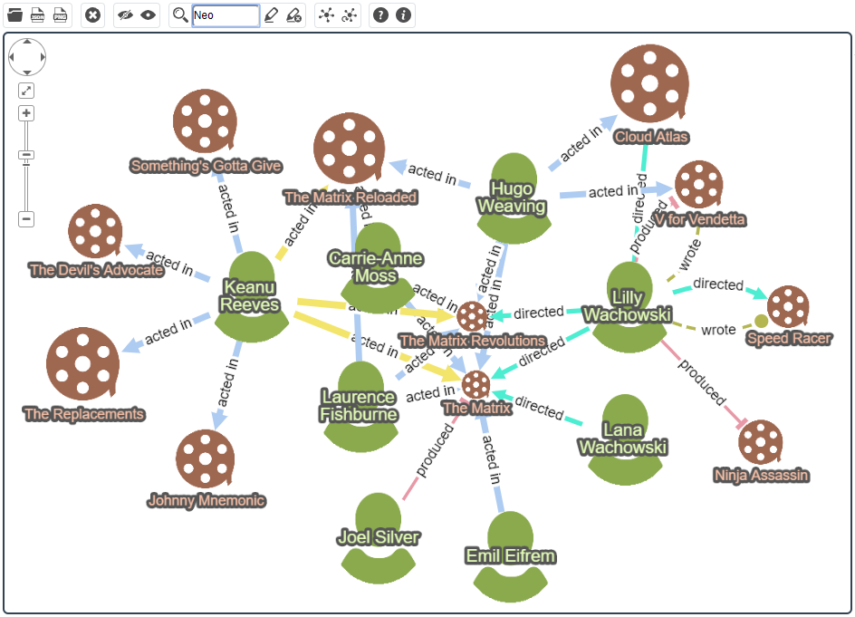

The layout operations may be used to either "tidy up" the layout of the current map using `Layout > Perform Layout`. This operation takes current locations of map objects into account and performs an *incremental layout* by optimizing their geometric distances to be in line with their graph theoretic distances. However, if you think that you're not happy with the current layout and would like a new one to be calculated *from sctratch*, they you should perform `Layout > Recalculate Layout`. Notice that an incremental layout is applied on some interactive operations where the result of a query is *merged* into the current map instead of replacing it. When, however, the result of an operation is to *replace* the current map content, layout is recalculated from scratch. Below is the same movie network laid out randomly (left), and automatically by Visuall (right).

  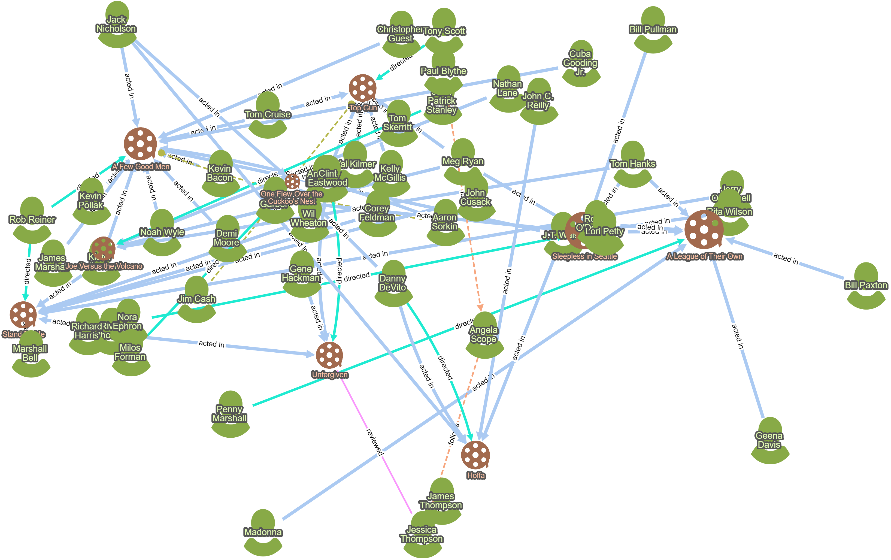&emsp;&emsp;&emsp;&emsp;
  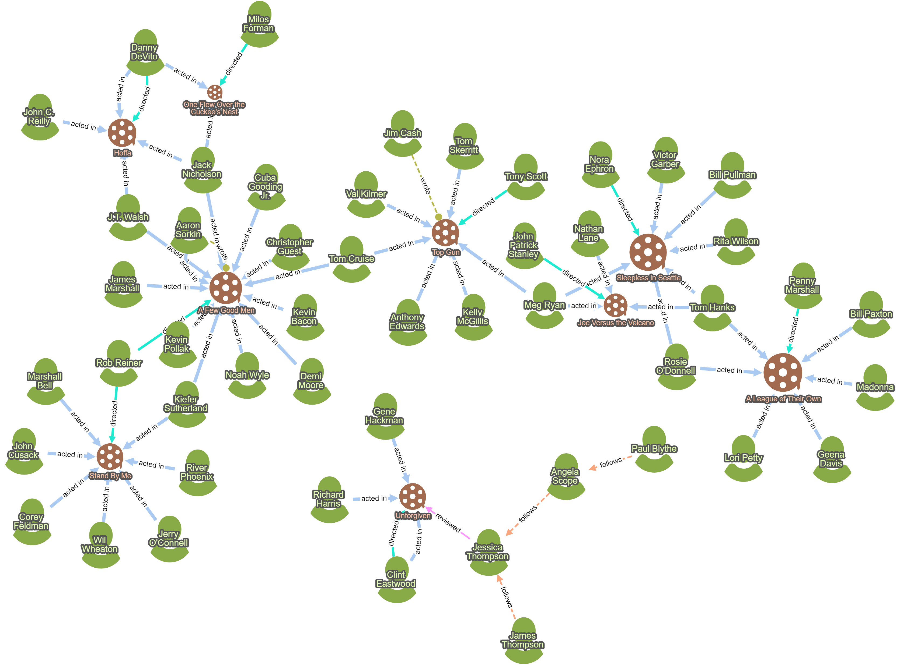

A quick help is available under the Help menu to quickly enumerate some gestures to manipulate the drawings in the canvas.

### Context menus

Visu*all* has some context dependant operations per node and edge type as well as for the map. To enable the context menu of a specific map object, simply right click on that object. For instance, when you click on a movie, you'll be presented with a set of operations that are specific to movies such as "Use Movie Poster", which brings and uses the poster of the associated movie in the map from a public web service. To pop up the graph menu, right-click on the canvas, where there is no node or edge.

  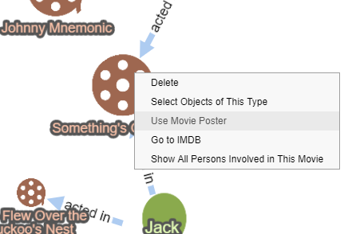

## Toolbar

A toolbar is available right under the menubar to lists some frequently needed operations grouped in the same manner as the menu.

## Object Inspection

Each node and edge has a set of properties (property-value pairs) as defined in the associated [model description file](../src/assets/app_description.json) of the Visu*all* application. If you click on a graph object (a node or an edge) to select it, any current selection will be lifted and the graph object that you clicked on will be selected. As a graph object is selected, its properties are shown on the right panel under the "Object" tab. Below is a map where a movie was selected and is being inspected in the Object tab in the right panel.

  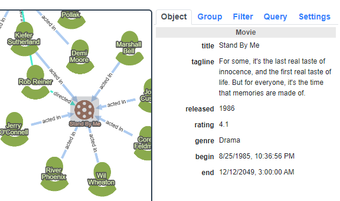

Other objects may be added to current selection using the Shift + click. On multiple object selection, Visu*all* determines any common properties of such objects, and displays only those common properties.

## Grouping

Visu*all* allows nesting of maps through groups or clusters. One way to group movies and persons involved is the [Markov clustering algorithm](https://js.cytoscape.org/#eles.markovClustering) available in Cytoscape.js. This algorithm pays attention only to the connectivity of the nodes ignoring any domain specific information. The alternative grouping mechanism available in Visu*all* is grouping by director. Here a director and the movies directed by this director are grouped together into a *compound* or *parent* node. However, if a movie is directed by multiple people, we leave the movie outside any such group (e.g. the movie "The Matrix" in the example below). Below is an example where a sample movie network is not grouped (left) and grouped by director (right).

  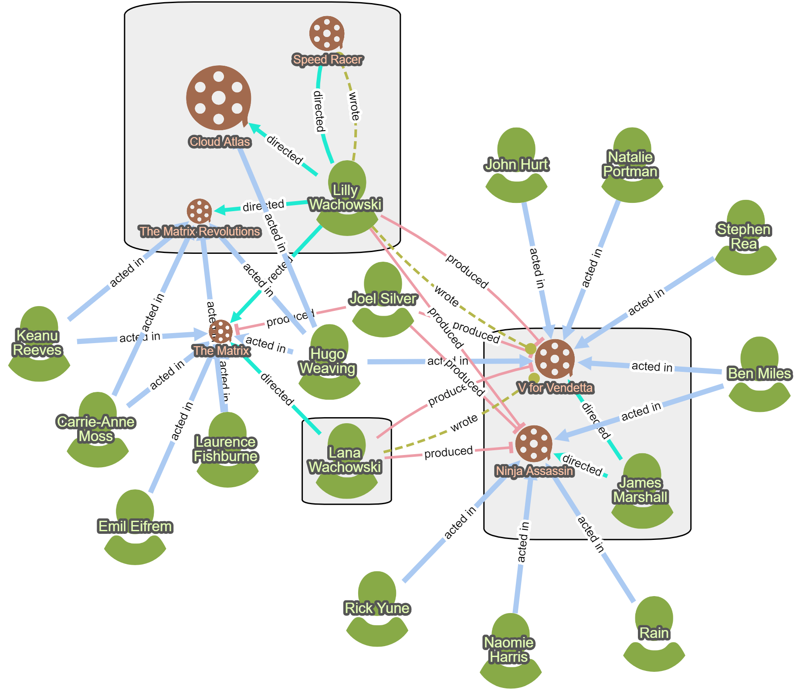

## Filtering

### Filtering by type

One important way to reduce complexity of a drawing is to filter out certain types of objects or relationships from your map. Visu*all* facilitates this by providing a button per graph object. Below is an example where a map is shown with all node and edge types (top) and the same map after `ACTED_IN` edge was filtered out (bottom).

  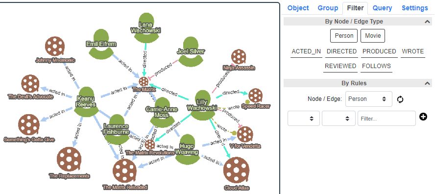

  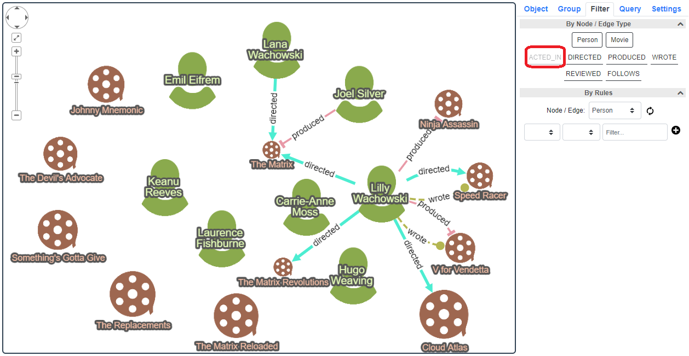

### Filtering by rule

Often times, the user will like to filter the content available in the database or in the client side by some rules. Visu*all* facilitates this by letting the user to put together some rules via relational and logical operators.

First, the user chooses an object type, followed by a property of that object type, a relational operator, and a value. For instance, if we are interested in movies whose rating is greater than 8, we should choose the object type `Movie`, choose the property `rating`, select >, and input 8 as the value. Then, upon clicking the + icon, the rule is added as shown below.

  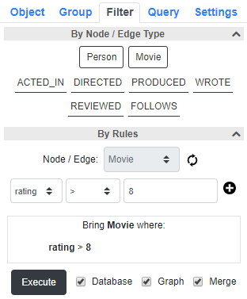

In case the chosen object type is a node, the user may also choose an incident edge type on that particular node type. For instance, when the object type is `Person`, along with the properties of `Person` objects such as name, compatible edge types such as `ACTED_IN` will be listed to construct a rule. When an edge type is chosen for a selected node type, the rules will be based on edge count (degree of that node type for that particular edge type). As an example, if we're interested in all persons who acted in more than 5 movies, then we first choose the edge type as `Person`. Then, since the rule is to depend on degree of `Person` nodes, on `ACTED_IN` edges, we select `ACTED_IN` from the dropdown menu. Finally, we select > as the logical operator, 5 as the value, and hit the + sign to add the rule as shown below.

  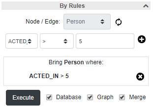

One can combine rules that belong to the same object type through logical operators as well. For instance, if we are interested in movies with rating at least 8 *and* released after 2000, we can put together a rule composed of both components as follows. Notice here that the logical operator between multiple rule components is `OR` by default, but could be changed to `AND` by clicking on it.

  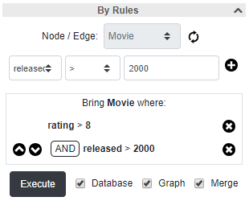

Before we actually run and obtain the result of the rule, we have some options we might consider adjusting:

- **Database**: When this is enabled, the rule is applied to the objects in the database as opposed to the objects currently in the browser (i.e. the client side as model by a Cytoscape.js graph).

- **Graph**: When this is checked, the query result is shown in the graph drawing canvas. In case, we think the result might be too big to display at once in the canvas, however, we could check this option off, and get the result as a table. The result in the table can then be gradually displayed in the canvas by clicking on the corresponding icon . To expand and fully show the table click on "..." in the header of the first column.
    
    For the above example rule for movies with rating greater than 8 and released after 2000, when `Graph` is disabled, the result will look as a table:

    

        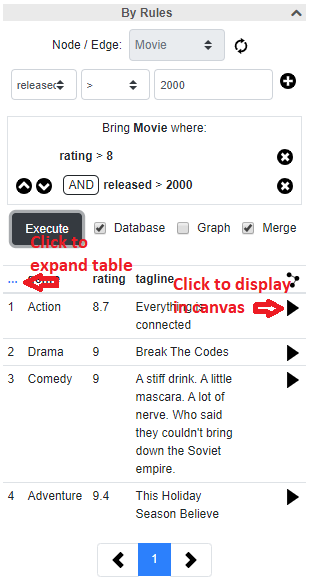
    

    Assuming the user decided to display only some of the movies in this query result by clicking on the associated icon in those rows, the canvas will display these movies and people involved as follows:

    

        
    

    Also notice that when the user hovers the graph icon in the table, the corresponding movie and people involved will be emphasized by ghosting the remaining map objects (movie titled "RescueDawn" is emphasized in the above example as described).

- **Merge**: When this option is enabled, the graph currently in the canvas stays and the result is *merged* into it, without avoiding duplication. For example, if the movie "The Matrix" was already in the graph and the query result contains this movie, we do not redundantly display "The Matrix" movie as a separate node. This should better enable the user to *connect the dots* between objects under analysis.

The user may change the limit for number of objects to be displayed at once (in the table or in the graph) from the Settings tab in the right panel using the option titled "Query result limit".

-  / : When the user clicks this button the table is maximized or expanded, and can be moved around. It becomes easier to see the full contents in this state. Clicking the icon at the same location again minimizes or docks the table back to the panel. When in minimized state, the number of columns shown in the table can be configured by the user under Settings ("Maximum number of columns in tables"). 

## Querying

Filter tab facilitates composition of some useful rules to bring a graph of interest for analysis. However, some specialized queries resulting in more advanced Cypher scripts are needed for most applications. Visu*all* dedicates the Query tab to fulfilling this aim. In our sample application for instance, using the query named "Get actors by movie counts" allows the user to get all actors (and the movies that they played in) who played in at least specified number of movies during the specified time range. The query interface is similar to the "Filter By Rules" interface and allows users to choose whether or not the result is to displayed in the graph canvas and whether or not the result should be merged to the current map or replace it.

In any case, the results are also displayed as a table to enable faster inspection of graph objects.

Below is an example query for finding all actors who played in at least 3 movies between speficific dates from 1960 to 2020.

    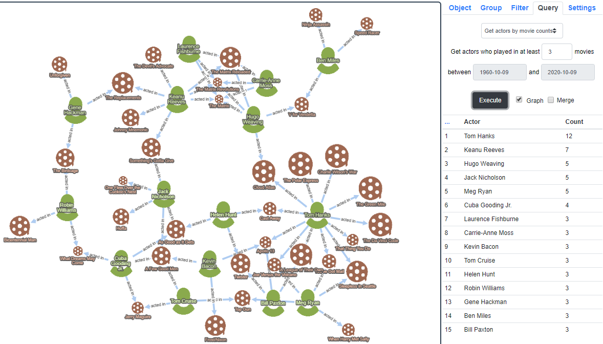

## Timebar

The timebar located below the graph drawing canvas is used to:
- filter nodes and edges based on their lifetimes
- show statistics for specified time ranges

In other words, it shows the situation of the network in a particular datetime range.

Here we assume that each graph object (node or edge) has a *lifetime* associated with it, which is expressed as an ordered pair [b,e] of begin and end datetimes, respectively, with b,e &#8712; (-&#8734;,+&#8734;). Datetimes are expressed and stored in the database as [this Unix standard in milliseconds](https://currentmillis.com/).

The kind of queries / questions we would like to be able to answer via such a timebar include:
- In a graph about movies, actors, etc. we would like to analyze movies filmed during a certain time period (e.g. 1980s).
- In a graph about football clubs and players, etc. we would like to know all those players who were actively playing football during a certain time period (e.g. in season 2017-2018).

First, let's define our terminology:
- **Global range** contains all nodes and edges’ lifetimes going from the minimum begin datetime of a graph object to the maximum end datetime of a graph object. These values are defined programmatically by the developer in a so-called [model description file](../src/assets/app_description.json).

- **Stats range** is the range for displaying pre-configured statistics about our graph objects. This is typically a narrower range than the global range. 

- **Graph range**, on the other hand, is a constant proportion of the stats range and determines what gets displayed in the graph drawing canvas. 

In below example, three different statistics were configured and is collected for the current graph.

    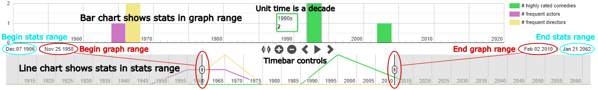

### Unit time
Depending on the length of the stats range, we determine a *unit time* (e.g. hour or month) and display the time and the corresponding statistics in increments of that unit time. For instance, if the stats range is March 1, 2019 11am to March 2, 2019, 2pm then the unit time is hours by default. However, if the user zooms in to see more refined situation, then the unit would be gradually adjusted to be first minutes, and then seconds if needed. Options for unit time could be as follows: *century*, *decade*, *year*, *quarter* (3 months), *month*, *week*, *day*, *hour*, *minute*, *second*, and *millisecond*. The unit time is also to be used to collect statistics during the current stats range displayed as line and bar charts. Notice that a unit time is to include the beginning of that unit but exclude the end of that unit time. For instance, if the unit time is a year, then each year is to be formed as [12:00:00AM in 1/1/1980,12:00:00AM in 1/1/1981), [12:00:00AM in 1/1/1981, 12:00:00AM in 1/1/1982), and so on.

In the above example current unit time is a year. Hence, each stat to be shown (# of nodes, edges, and nodes + edges) is calculated and displayed for each year.

### Stat(s) to display
We display a certain value corresponding to the properties of nodes and/or edges as a line chart for the entire stats range and a bar chart for the graph range at each specific time unit within the range. This could be as general as the size of the network (the sum of the number of nodes and edges) at that particular time unit or could be specific to the application such as number of movies being filmed during a unit time. So, if the unit time is a month and say during January 2019 (starting from the beginning of the month until the end of the month), 100 nodes and 150 edges existed (see below the criteria for including/excluding a node/edge in a time unit) and is displayed, then the value for this month should be 100+150=250. 

### Timebar controls
Controls located in the middle of the timebar may be used to change/set the graph/stat range.

-  sets the stats range to be the same as the global range.

-  zooms in to (shrinks) the stats and graph range.

-  zooms out to (expands) the stats and graph range.

-  steps backward and moves the stats and graph range back in time.

-  starts an animation to move the stats and graph range forward in time.

-  pauses the ongoing animation to stop movement of the stats and graph range forward in time.

-  steps forward and moves the stats and graph range forward in time.

## Settings

### General settings

General properties of the map displayed as well as various options on filtering, queries, and timebar can be adjusted through the Settings tab in the right panel.

- **Perform layout on changes**: As changes occur in the graph (e.g. bring people involved in a movie using the context menu for movies), whether or not an incremental layout is to be applied to tidy up the drawing.

- **Highlight on hover**: When the mouse is over a node, whether or not the node and its neighbors are to be emphasized by ghosting the remaining objects.

- **Show overview window**: Whether or not an overview window (a smaller graph view) is to be shown. This is especially useful with large graphs to navigate the user.

- **Show edge labels**: Whether or not edge labels (types) should be displayed over edges in the map. If there is up to only a few edge types, the user might not need the labels to differentitate the relation types.

- **Fit labels to nodes**: Whether or not the node labels are to fit the node width. If enabled, longer labels will be truncated with ellipses.

- **Ignore case in text operations**: When the user searches for map objects with certain string in their labels or property values, whether or not the search is to be performed as case sensitive.

- **Show query results using**: When a query's result is shown in the graph canvas, if the user enabled merge, do we use *selection* or *highlight* to emphasize the map objects in the result.

- **Query result limit**: Limit for the number of object to be shown at once to the user (as a table and/or as a graph). 

- **Maximum number of columns in tables**: Maximum number of columns in a table resulting from a filter or query operation. Since the right panel has limited width, the users might like to adjust how many columns usually fit in this panel. In any case, as described earlier, the user has the option to expand the table and show in its entirity as a floating dialog.

- **Highlight width**: The width (edge or node border thickness) of the highlight operation

- **Compound padding**: The padding used around child map objects in a nested drawing, created as a result of grouping through the Group filter. The user has the option to specify an absolute value or a percentage of the compound dimensions.

### Timebar settings

General properties of the timebar may be configured through the Settings tab in the right panel. 
- **Show timebar**: The user might opt to hide the timebar completely by unchecking this option.

- **Hide disconnected nodes on animation**: When checked, disconnected nodes that typically clutter the map will be hidden from the graph.

- **Animation step**: Determines how quickly the move forward and backward buttons should move the graph and stats ranges.

- **Animation period**: Determines how quickly the graph and stats ranges should move forward in time during animation (play).

- **Zoom sensitivity**: Determines how fast the graph and stats ranges should be expanded or shrunk during zoom out and in operations.

- **Graph inclusion type**: Determines the criteria for a graph object to be included in the drawing canvas for the current graph range. A graph object will be shown in the drawing canvas only if the current graph range:
    - *overlaps*: overlaps
    - *contains*: completely contains
    - *contained by*: is completely contained by

    the object's life.

- **Statistics inclusion type**: We collect stats for each graph object with respect to the current unit time. Each graph object either contributes to exactly one unit time or to all unit times that its lifetime overlaps with depending on a user specified option stats inclusion type as follows. The graph object contributes
    - *begin*: only to the very first unit time
    - *end*: only to the very last unit time
    - *middle*: only to the very middle unit time (the unit time which is most central)
    - *all*: to all unit times

    it overlaps with.

- **Configure Statistics**:

The value(s) to display in line/bar charts are customizable under the Settings tab in section named "Configure Stats".

The user may define which type of objects are to contribute to the statistics and under what conditions/rules with the provided interface. You may choose a proper name for your stat and assign a desired color (in case you don't like the automatically assigned one).

In the example below, the user creates a new statistic to count the number of comedy movies whose rating is greater than 7 as "# highly rated comedies", and assigns green to denote it.

    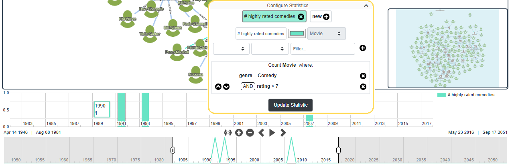

An arbitrary number of statistics could be formed and visualized as described.